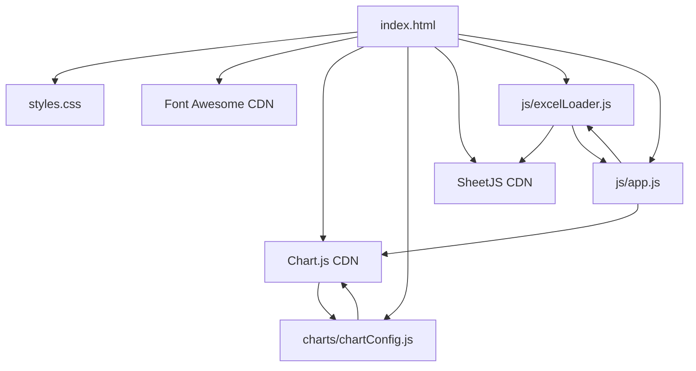
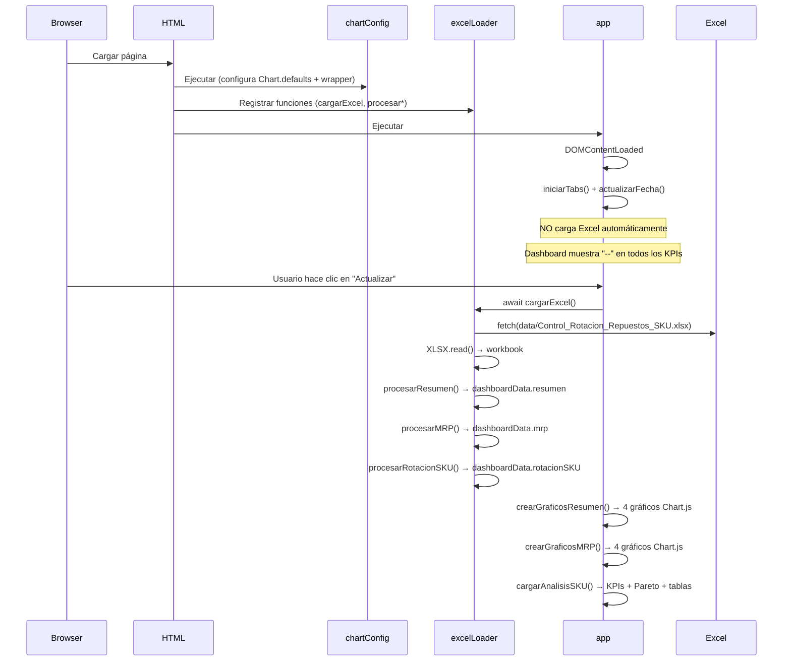
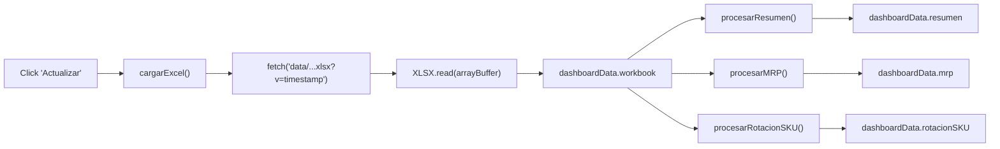
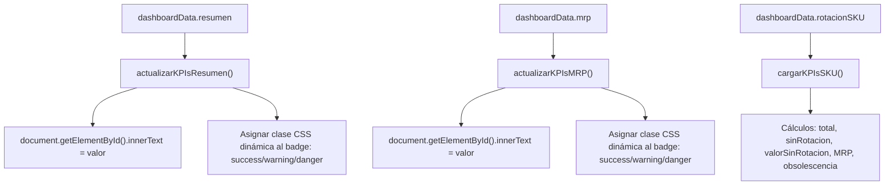
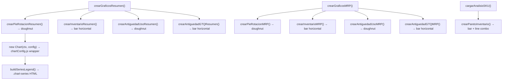
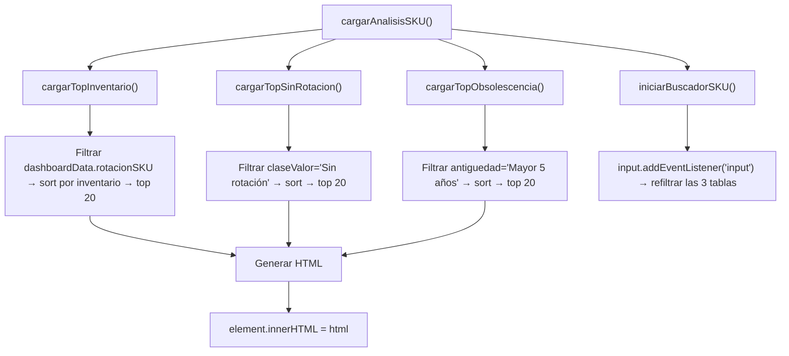

# 🏗️ ARCHITECTURE.md — Control Tower de Repuestos

> Última actualización: 2026-07-01

---

## Estructura de Carpetas

```
fffuentes.github.io/
├── index.html              ← HTML estático. 3 tabs, header, carga de CDNs y scripts
├── docs/                   ← Documentación del proyecto
│   ├── DEV_NOTES.md
│   ├── ARCHITECTURE.md
│   ├── CHANGELOG.md
│   ├── TODO.md
│   └── CONTRIBUTING.md
├── css/
│   └── styles.css          ← Tema oscuro "Excel Premium", ~870 líneas. Sin frameworks CSS
├── js/
│   ├── app.js              ← Núcleo: tabs, gráficos, KPIs, Pareto, resize handlers (~2000 líneas)
│   ├── excelLoader.js      ← Fetch + parseo del Excel con SheetJS. 3 funciones de procesamiento
│   ├── chartFactory.js     ← Placeholder (vacío)
│   └── helpers.js          ← Placeholder (vacío)
├── charts/
│   └── chartConfig.js      ← Chart.js global defaults + wrapper constructor (auto .chart-series)
├── data/
│   └── Control_Rotacion_Repuestos_SKU.xlsx  ← Única fuente de datos
├── assets/                 ← Vacío (reservado para imágenes/iconos)
└── dev-tests/              ← Vacío (reservado para pruebas)
```

---

## Responsabilidad de cada archivo

| Archivo | Rol | Dependencias |
|---|---|---|
| `index.html` | Estructura DOM. Header, 3 tabs, paneles, scripts | `styles.css`, CDNs, `chartConfig.js`, `excelLoader.js`, `app.js` |
| `css/styles.css` | 100% del estilo visual. Variables CSS, grid, flex, responsive | Ninguna |
| `js/app.js` | Lógica de UI: tabs, fecha, botón Actualizar, creación de gráficos, KPIs, Pareto, tablas, resize/zoom | `Chart` (global), `cargarExcel()` (excelLoader), `dashboardData` (global) |
| `js/excelLoader.js` | `cargarExcel()` → fetch + XLSX.read + 3 procesadores | `XLSX` (CDN), `dashboardData` (global en app.js) |
| `charts/chartConfig.js` | `Chart.defaults` globales + monkey-patch del constructor `Chart` | `Chart` (CDN) |
| `data/*.xlsx` | Datos estáticos. 3 hojas: Resumen, Resumen MRP, Rotación_SKU | Ninguna (leído por excelLoader.js) |

---

## Dependencias entre módulos



- `chartConfig.js` se carga antes que `app.js` → configura Chart.js antes de usarlo
- `excelLoader.js` se carga antes que `app.js` → `cargarExcel()` existe cuando se necesita
- `app.js` y `excelLoader.js` comparten `dashboardData` (objeto global)

---

## Flujo de ejecución



---

## Flujo de carga del Excel



### Hojas del Excel

| Hoja | Datos extraídos | Columnas clave |
|---|---|---|
| `Resumen` | KPIs globales | Rotación, clasificación, SKU total, inventario, antigüedad |
| `Resumen MRP` | KPIs filtrados a MRP | Igual que Resumen + consumo anual |
| `Rotación_SKU` | ~3400 filas detalle | SKU, descripción, inventario, consumo, fechas, clasificación, MRP |

Cada hoja se lee con `XLSX.utils.sheet_to_json(hoja, { header: 1 })` (formato array de arrays). Las posiciones de celda están hardcodeadas (ej. `datos[0][1]`).

---

## Flujo de renderizado de KPIs



Los KPIs se actualizan por `innerText` directo sobre elementos con ID. Los badges de clasificación (Alta/Media/Baja) reciben clase CSS dinámica.

---

## Flujo de renderizado de gráficas



Cada gráfico se crea con `new Chart(ctx, config)`. El wrapper en `chartConfig.js` intercepta el constructor y añade automáticamente el bloque `.chart-series` debajo de cada gráfico.

---

## Flujo de renderizado de tablas



Las tablas se generan como strings HTML y se insertan vía `innerHTML`. El buscador refiltra las 3 tablas simultáneamente.
